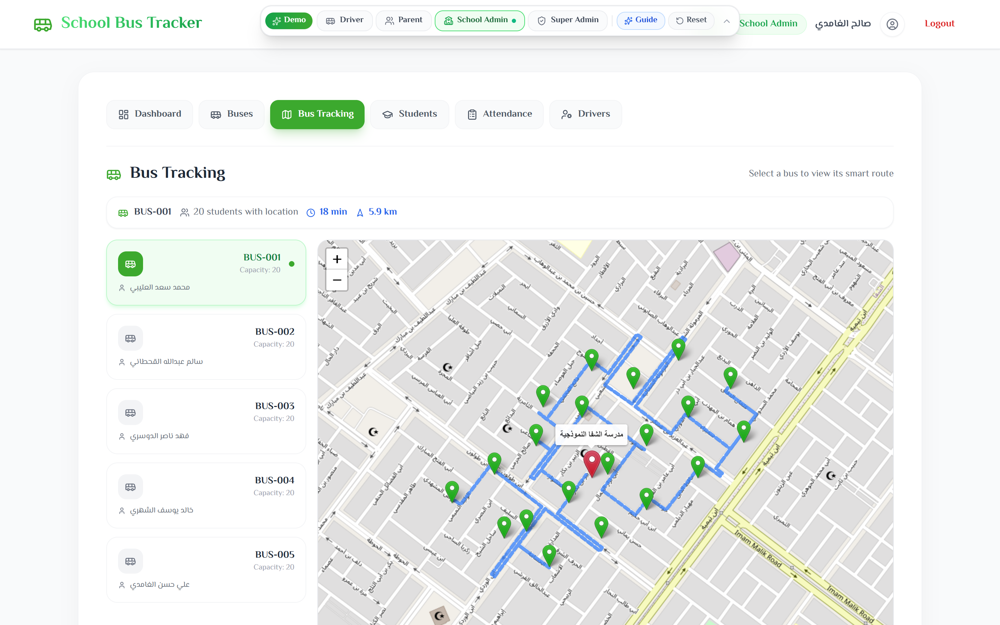
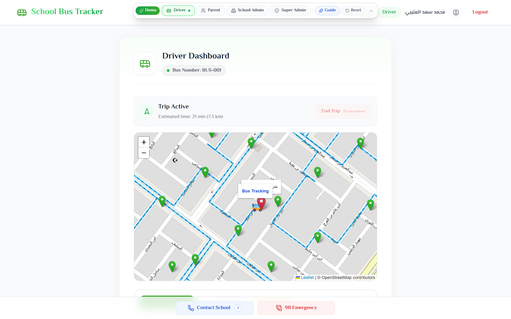
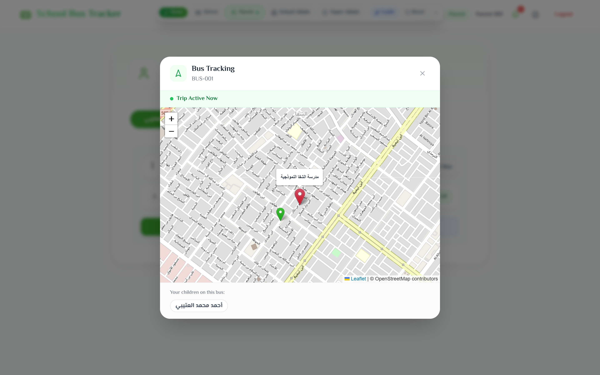
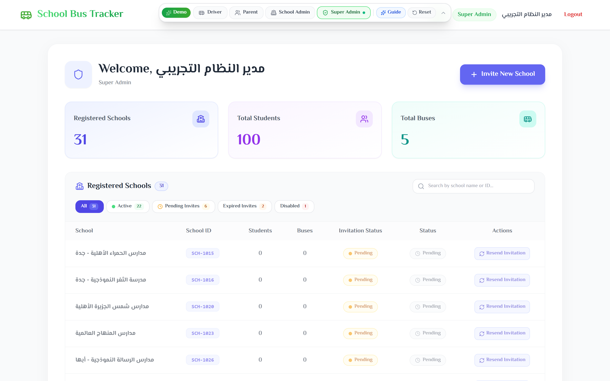
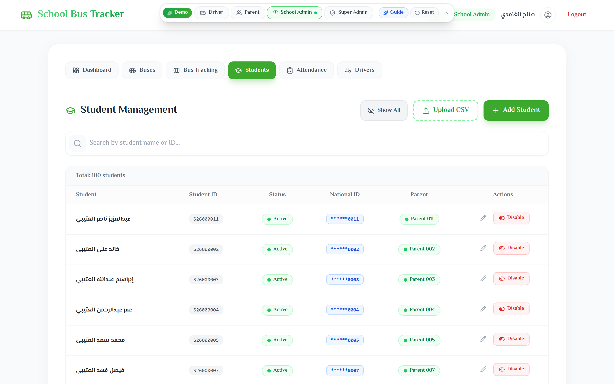
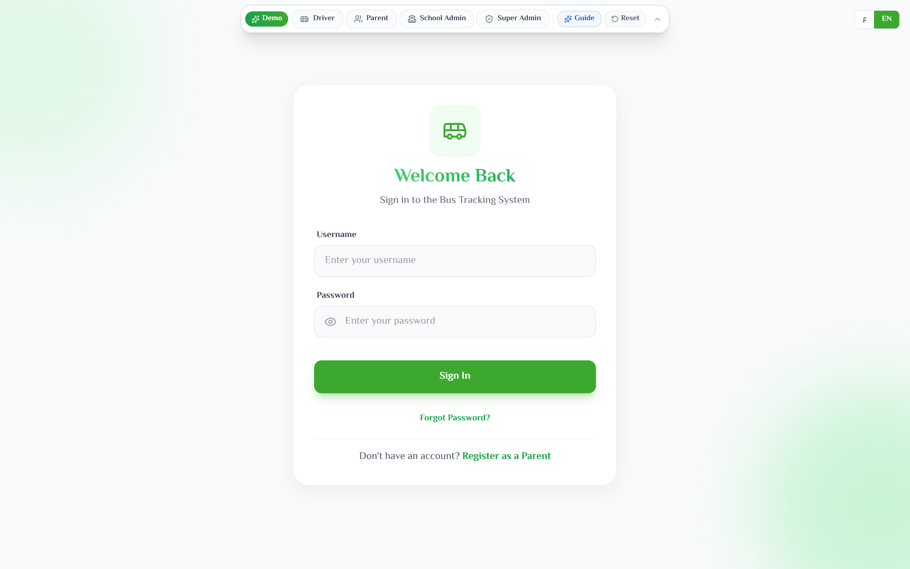

# SBTS — School Bus Tracking System

A full-stack, real-time web platform for managing and tracking school buses. It connects four user roles — **Super Admins**, **School Admins**, **Drivers**, and **Parents** — into one system that handles everything from route planning and live GPS tracking to digital attendance and parent notifications.

The entire UI is bilingual (English / Arabic) with full RTL support.

---

## Table of Contents

- [Screenshots](#screenshots)
- [Features by Role](#features-by-role)
- [Tech Stack](#tech-stack)
- [Architecture Overview](#architecture-overview)
- [Getting Started](#getting-started)
- [Docker Deployment](#docker-deployment)
- [Demo Mode](#demo-mode)
- [Testing](#testing)
- [Project Structure](#project-structure)
- [Security & Privacy](#security--privacy)
- [Localization](#localization)
- [Maps & Routing](#maps--routing)

---

## Screenshots

<div align="center">

### School Admin — Live Fleet Map
*Interactive Leaflet map showing OSRM-calculated routes, student pickup locations, live distance/ETA metrics, and bus allocation.*
<br/>



<br/>

### Driver — Active Trip & Real-Time Navigation
*Turn-by-turn routing with moving bus coordinates, upcoming student stops, and emergency communication tools.*
<br/>



<br/>

### Parent — Real-Time Bus & Student Tracking
*Parent portal tracking active bus location, proximity notifications, and student boarding status.*
<br/>



<br/>

### Super Admin — Multi-Tenant Platform Overview
*High-level control panel tracking registered schools across Saudi cities, total buses, students, and invitation link status.*
<br/>



<br/>

### School Admin — Student Management & Data Masking
*Student registry featuring AES-256 encrypted Saudi National IDs, CSV bulk import, and parent account linking.*
<br/>



<br/>

### Authentication & Interactive Demo Bar
*Bilingual sign-in interface with the quick-switch Demo Role Bar allowing instant role exploration without manual credentials.*
<br/>



</div>

---

## Features by Role

### Super Admin
- Generate time-limited, single-use invitation links for onboarding new schools.
- View platform-wide metrics: total schools, buses, students.
- Activate / deactivate schools.

### School Admin
- **Bus Management** — Create buses, assign drivers, auto-assign students to the nearest bus based on geographic proximity (Haversine distance with cosine latitude correction).
- **Route Management** — Draw routes on an interactive map; the system calls the OSRM API to compute the optimal street-level path.
- **Student Management** — Add students individually or bulk-import via CSV. National IDs are validated (Saudi format: 10 digits, starts with 1 or 2, supports Arabic-Indic numerals) and stored AES-256 encrypted.
- **Driver Management** — Create and manage driver accounts.
- **Live Fleet Map** — Real-time map showing all active buses in the school, updated through WebSocket events.
- **Attendance Records** — Filterable logs of boarding, drop-off, absence, and no-receiver events with PDF report generation via Puppeteer.
- **Emergency Contacts** — Manage school-level emergency contacts accessible to drivers during trips.

### Driver
- **Trip Dashboard** — Step-by-step workflow for morning (to school) and afternoon (to home) trips.
- **Navigation Map** — Interactive map with the OSRM-optimized route and student stop markers.
- **Digital Attendance** — Mark each student as Boarded, Absent, Dropped Off, No Board, or No Receiver. Supports undo.
- **Smart Targeting** — The system automatically suggests the nearest unresolved student, but the driver can manually override the target.
- **GPS Broadcasting** — Location updates are sent via Socket.io and trigger the Proximity Engine server-side.
- **Emergency Quick-Dial** — One-tap buttons for 911, school admin, and parent contacts.

### Parent
- **Real-Time Bus Tracking** — Live map showing bus position when the trip is active.
- **Live ETA** — Estimated time of arrival to the student's stop, recalculated on each location update.
- **Secure Onboarding** — Two-step OTP verification using the student's National ID and date of birth to link a child to a parent account. Rate-limited to 3 OTPs per 15 minutes.
- **Push Notifications** — Firebase Cloud Messaging (FCM) alerts when the bus is approaching, when the student boards, and when they are dropped off.
- **Student Relinking** — If a parent-student link is removed by the school admin, the parent can re-link within a 30-day grace period before the parent account is scheduled for deletion.

---

## Tech Stack

### Backend
| Layer | Technology |
|---|---|
| Runtime | Node.js 20 |
| Language | TypeScript (strict) |
| Framework | Express 5 |
| Database | MongoDB (Mongoose 9) |
| Real-time | Socket.io |
| Auth | JWT + bcryptjs |
| Push Notifications | Firebase Admin SDK (FCM) |
| Data Privacy | AES-256-CBC encryption (National IDs) |
| PDF Reports | Puppeteer (Chromium) |
| File Uploads | Multer + csv-parser |
| Email | Nodemailer |
| Security | Helmet, RBAC middleware, tenant isolation |
| Testing | Jest + Supertest + mongodb-memory-server |

### Frontend
| Layer | Technology |
|---|---|
| Framework | React 18 (Vite) |
| Language | TypeScript |
| Routing | React Router DOM 6 |
| Styling | Tailwind CSS + custom CSS |
| Maps | Leaflet + React-Leaflet |
| Icons | Lucide React |
| i18n | i18next + react-i18next |
| HTTP Client | Axios |
| Real-time | Socket.io-client |

### Infrastructure
| Layer | Technology |
|---|---|
| Containerization | Docker (multi-stage builds) |
| Orchestration | Docker Compose |
| Reverse Proxy | Nginx (gzip, security headers, WebSocket proxy) |
| CI | GitHub Actions (TypeScript check, frontend build, Docker build verification) |

---

## Architecture Overview

```
┌──────────────┐       WebSocket (Socket.io)       ┌──────────────────┐
│              │◄─────────────────────────────────►│                  │
│   React SPA  │       REST API (Axios)            │  Express API     │
│   (Vite)     │◄─────────────────────────────────►│  Server          │
│              │                                    │                  │
└──────┬───────┘                                    └────────┬─────────┘
       │                                                     │
       │  Nginx (reverse proxy)                              │
       │  /api/* → backend:5000                              ├──► MongoDB
       │  /socket.io/* → backend:5000 (upgrade)              ├──► OSRM API (routing)
       │                                                     └──► FCM (push notifications)
       │
       └──► OpenStreetMap tiles (map rendering)
```

**Real-time data flow:**

1. Driver's browser sends GPS coordinates via Socket.io.
2. Server stores the position on the Trip document and emits location updates to two Socket rooms:
   - `admin_{schoolId}` — for the school admin's fleet map.
   - `parent_{parentId}` — for each parent tracking their child's bus.
3. The **Proximity Engine** runs server-side on each location update:
   - Computes Haversine distance from bus to each unresolved student.
   - Validates heading direction (bearing delta ≤ 45°) with a velocity gate (≥ 5 km/h) to suppress false positives when the bus is stationary.
   - When a student is within 500m and the bus is heading toward them, triggers a "bus approaching" notification (persisted to DB, emitted via Socket.io, and sent via FCM).
   - Respects a 5-minute cooldown per student to prevent notification spam.

---

## Getting Started

### Prerequisites
- Node.js ≥ 20
- MongoDB (local instance or [MongoDB Atlas](https://www.mongodb.com/atlas))
- Git

### Backend

```bash
cd backend
cp .env.example .env    # Fill in your MongoDB URI, JWT secret, and encryption key
npm install
npm run dev             # Starts on http://localhost:5000
```

On first launch, if no super admin exists, the server automatically creates one:
- **Username:** `superadmin` (configurable via `SUPERADMIN_USERNAME` env var)
- **Password:** `Aa1234` (configurable via `SUPERADMIN_PASSWORD` env var)

### Frontend

```bash
cd frontend
npm install
npm run dev             # Starts on http://localhost:5173
```

### Environment Variables

| Variable | Required | Description |
|---|---|---|
| `MONGO_URI` | Yes | MongoDB connection string |
| `JWT_SECRET` | Yes | Secret key for signing JWT tokens |
| `ENCRYPTION_KEY` | Yes | 32-byte key (or 64 hex chars) for AES-256 encryption of National IDs |
| `PORT` | No | Server port (default: `5000`) |
| `DEMO_MODE` | No | Set to `true` to enable demo mode |
| `SUPERADMIN_USERNAME` | No | Default super admin username (default: `superadmin`) |
| `SUPERADMIN_PASSWORD` | No | Default super admin password (default: `Aa1234`) |
| `SUPERADMIN_EMAIL` | No | Default super admin email |
| `FIREBASE_SERVICE_ACCOUNT_JSON` | No | Firebase service account JSON for FCM push notifications. If not set, push notifications are silently disabled. |

---

## Docker Deployment

The project includes production-ready multi-stage Docker builds:

- **Backend** — Builds TypeScript, copies only compiled JS to the runner image. Installs Chromium + Arabic fonts for Puppeteer PDF generation.
- **Frontend** — Builds the Vite SPA, serves it from Nginx with gzip compression, security headers, API reverse proxy, and WebSocket upgrade support.

```bash
# Production
docker compose up -d --build

# Seed demo data (optional, one-off)
docker compose --profile seed run --rm seed
```

Services:
| Service | Port | Description |
|---|---|---|
| `sbts-frontend` | 80 | Nginx serving the React SPA |
| `sbts-backend` | 5000 | Express API server |
| `sbts-mongodb` | 27018 | MongoDB 7 (mapped to 27018 to avoid conflicts) |

All services include health checks and `unless-stopped` restart policies.

---

## Demo Mode

Demo mode provides a sandboxed environment with pre-seeded data for showcasing the system. It includes:

- Two schools with full data (buses, drivers, students, routes).
- Pre-configured accounts for every role.
- A **Demo Role Switcher** floating bar in the frontend for instant role switching.
- An interactive **Demo Guide Modal** that walks through each feature.
- A **DemoGuard middleware** that protects demo accounts from being deleted or having their passwords changed.

### Running in Demo Mode

```bash
# Docker (recommended)
docker compose -f docker-compose.yml -f docker-compose.demo.yml up -d --build

# Local development
cd backend && npm run demo    # Backend with DEMO_MODE=true
cd frontend && npm run demo   # Frontend with VITE_DEMO_MODE=true
```

---

## Testing

The backend has **108 tests** across three layers:

```
tests/
├── unit/                      # Pure function tests (no DB)
│   ├── crypto.test.ts         # AES-256 encrypt/decrypt/mask
│   ├── geoUtils.test.ts       # Haversine, bearing, speed calculations
│   └── textUtils.test.ts      # Arabic normalization, Saudi ID validation
├── services/                  # Service layer tests (in-memory MongoDB)
│   ├── AuthService.test.ts    # Login, OTP registration, password reset
│   ├── StudentService.test.ts # CRUD, CSV bulk import, parent unlinking
│   ├── TripService.test.ts    # Trip lifecycle, attendance, targeting
│   └── ProximityEngine.test.ts # Bearing validation, zone detection, cooldowns
└── integration/               # Full HTTP request tests (Supertest)
    ├── apiEndpoints.test.ts   # Health check, login, privacy leak protection
    ├── authGuard.test.ts      # JWT validation, RBAC enforcement
    ├── demoGuard.test.ts      # Demo account protection
    └── tripsApi.test.ts       # Trip start/end, attendance via API
```

```bash
cd backend
npm test                # Run all 108 tests
npm run test:watch      # Watch mode
npm run test:coverage   # With coverage report
```

Tests use `mongodb-memory-server` — no external database needed.

---

## Project Structure

```
SBTS/
├── backend/
│   ├── src/
│   │   ├── config/           # Database connection
│   │   ├── controllers/      # Request handlers (12 controllers)
│   │   ├── middleware/        # Auth, RBAC, tenant isolation, demo guard, error handler
│   │   ├── models/           # Mongoose schemas (User, School, Bus, Student, Trip,
│   │   │                     #   Route, Attendance, Notification, Invitation, OTP)
│   │   ├── routes/           # Express route definitions (13 route files)
│   │   ├── services/         # Business logic (9 service classes)
│   │   ├── types/            # TypeScript type definitions
│   │   ├── utils/            # Crypto, geo math, proximity engine, FCM, socket, text utils
│   │   ├── app.ts            # Express app setup
│   │   ├── server.ts         # HTTP + Socket.io server entry point
│   │   ├── seed.ts           # Basic seeder
│   │   └── seed-demo.ts      # Full demo data seeder (510 lines)
│   ├── tests/                # Jest test suites (108 tests)
│   ├── Dockerfile            # Multi-stage production build
│   └── package.json
│
├── frontend/
│   ├── src/
│   │   ├── components/       # Reusable components (17 + 4 map components)
│   │   ├── context/          # Auth context (JWT token management)
│   │   ├── hooks/            # Custom hooks (notifications)
│   │   ├── pages/            # Page components (8 pages + 6 admin sub-pages)
│   │   ├── services/         # Axios API service
│   │   ├── types/            # TypeScript interfaces
│   │   ├── utils/            # Validation, Haversine, error utilities
│   │   └── App.tsx           # Router with role-based route guards
│   ├── public/locales/       # i18n translation files (en + ar)
│   ├── nginx.conf            # Production Nginx config
│   ├── Dockerfile            # Multi-stage build (Vite → Nginx)
│   └── package.json
│
├── shared/
│   └── types/                # Shared TypeScript types (error codes, GPS, sockets, bus, attendance)
│
├── .github/workflows/ci.yml  # CI pipeline (TypeScript check + build + Docker verification)
├── docker-compose.yml         # Production stack (MongoDB + Backend + Frontend)
└── docker-compose.demo.yml    # Demo mode overlay
```

---

## Security & Privacy

- **Authentication** — JWT tokens with configurable expiry. Passwords hashed with bcrypt (10 rounds).
- **Role-Based Access Control (RBAC)** — Every API route is protected by `authMiddleware` → `roleMiddleware(['role'])` → `tenantMiddleware`. A school admin can only access data within their own school.
- **Tenant Isolation** — `tenantMiddleware` injects `req.schoolId` from the authenticated user's school. Super admins are unscoped.
- **National ID Encryption** — Student National IDs are encrypted at rest using AES-256-CBC with a random IV per record. API responses return masked IDs (e.g., `******1234`) — the plaintext is never exposed through the API.
- **OTP Rate Limiting** — Parent registration OTPs are capped at 3 per phone number within a 15-minute window.
- **User Enumeration Prevention** — The forgot-password endpoint returns a uniform success message regardless of whether the email exists.
- **Demo Guard** — In demo mode, a middleware prevents deletion or password changes on protected demo accounts.
- **Nginx Security Headers** — `X-Frame-Options`, `X-XSS-Protection`, `X-Content-Type-Options`, `Referrer-Policy`.
- **Helmet** — Standard HTTP security headers on the Express backend.

---

## Localization

The system supports **English** and **Arabic** with full RTL layout switching. The language direction is applied at the `<html>` element level on language change.

Translation files:
- `frontend/public/locales/en/translation.json`
- `frontend/public/locales/ar/translation.json`

Arabic-specific text processing:
- **Name normalization** — Unifies Alef forms (أ, إ, آ, ٱ → ا), Teh Marbuta (ة → ه), Alef Maksura (ى → ي), removes diacritics and Tatweel.
- **Digit conversion** — Converts Eastern Arabic-Indic numerals (٠-٩) to standard digits (0-9) for Saudi keyboard inputs.

---

## Maps & Routing

- **Map tiles** — OpenStreetMap via Leaflet / React-Leaflet.
- **Route optimization** — OSRM (Open Source Routing Machine) public API for computing optimal street-level paths between student stops.
- **Geospatial queries** — MongoDB 2dsphere indexes on Student and School locations.
- **Geo utilities** — Custom Haversine distance, compass bearing, bearing delta, and speed calculation functions (all unit tested).
- **Proximity Engine** — Server-side engine that evaluates bus-to-student proximity on each GPS update using:
  - Haversine distance (2km outer zone, 500m notification zone)
  - Bearing validation with 45° tolerance
  - Velocity gate (5 km/h minimum to update heading — prevents false alerts when parked)
  - Per-student 5-minute notification cooldown

---

## License

ISC
